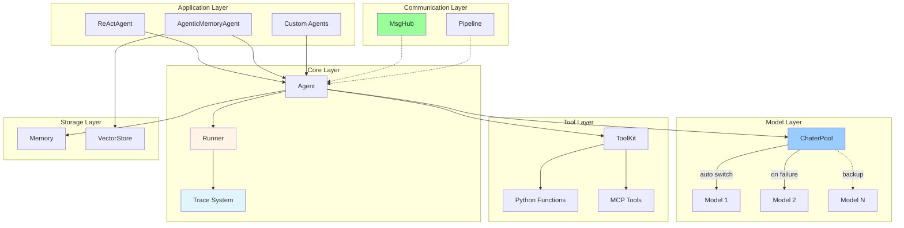

<div align="center">


# PyAgent

_Lightweight Multi-Agent Framework for Python_

[](https://www.python.org/downloads/)
[](LICENSE)


</div>

---

## ✨ Features

- 🎯 **Minimalist** - Clean design, only 12 core modules
- 📊 **Stack-based Trace** - Auto-track multi-agent interactions
- ⚡ **Async-first** - Full async I/O, concurrent tool execution
- 🔄 **Auto-failover** - ChaterPool switches models automatically
- 🧠 **A-MEM** - Self-evolving memory ([arXiv:2502.12110](https://arxiv.org/abs/2502.12110))
- 🤖 **ReAct** - Complete reasoning-action loop
- 🛠️ **MCP** - Native Model Context Protocol support
- 🌐 **Multi-agent** - MsgHub broadcast, Pipeline orchestration

## 🚀 Quick Start

```python
import asyncio
from pyagent import Agent, Memory, Runner, get_chater_cfg

agent = Agent(
    name="Assistant",
    chater=get_chater_cfg("zhipuai"),
    memory=Memory(),
    system_prompt="You are helpful."
)

async def main():
    result = await Runner.run(agent, "Hello!")
    print(result.content)

asyncio.run(main())
```

### Multi-Agent with Trace

```python
from pyagent import trace, Runner, Agent

planner = Agent(name="Planner", ...)
executor = Agent(name="Executor", ...)

with trace("workflow"):
    result = await Runner.run_sequential(
        [planner, executor],
        "Plan and execute"
    )
```

## 📐 Architecture



**Features:**

- ✅ Stack-based - Auto parent-child management
- ✅ Concurrent-safe - contextvars isolation
- ✅ Zero-overhead - Fully disabled without trace
- ✅ Minimal data - Agent span: type/agent_id/input/output only
- ✅ Complete tracking - Generation/Tool/Custom spans

## 🎯 Components

| Component              | Description                                                                       |
| ---------------------- | --------------------------------------------------------------------------------- |
| **Agent**              | Base agent with hooks, streaming, tool calling                                    |
| **Runner**             | Unified interface for single/multi-agent execution                                |
| **ChaterPool**         | Auto-failover when primary model fails                                            |
| **ToolKit**            | Register Python functions or MCP tools                                            |
| **MsgHub**             | Multi-agent broadcast communication                                               |
| **Pipeline**           | Sequential/Parallel/Conditional/Loop patterns                                     |
| **AgenticMemoryAgent** | A-MEM self-evolving memory ([arXiv:2502.12110](https://arxiv.org/abs/2502.12110)) |

## 🙏 Acknowledgments

Inspired by:

- **[OpenAI Agents SDK](https://github.com/openai/openai-agents-python)** - Trace system, Runner pattern
- **[AgentScope](https://github.com/modelscope/agentscope)** - Hook decorators, MsgHub

## 📄 License

MIT License
