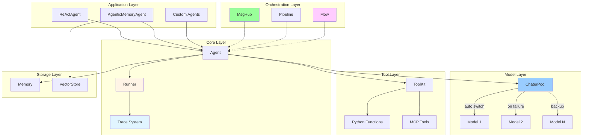

<div align="center">


# QAgent

_Lightweight Multi-Agent Framework for Python_

[](https://www.python.org/downloads/)
[](LICENSE)


</div>

---

## ✨ Features

- 🎯 **Minimalist** - Clean design, modular architecture
- 📊 **Stack-based Trace** - Auto-track multi-agent interactions
- ⚡ **Async-first** - Full async I/O, concurrent tool execution
- 🔄 **Auto-failover** - ChaterPool switches models automatically
- 🧠 **A-MEM** - Self-evolving memory ([arXiv:2502.12110](https://arxiv.org/abs/2502.12110))
- 🤖 **ReAct** - Complete reasoning-action loop
- 🛠️ **MCP** - Native Model Context Protocol support
- 🌐 **Multi-agent** - MsgHub broadcast, Pipeline orchestration
- 🔀 **Flow** - Lightweight workflow with loops, branches, parallel execution

## 🚀 Quick Start

```python
import asyncio
from qagent import Agent, Memory, Chater, get_chater_cfg

async def main():
    agent = Agent(
        name="Assistant",
        chater=Chater(get_chater_cfg("ali")),
        memory=Memory(),
        system_prompt="You are helpful."
    )
    response = await agent("Hello!")
    print(response.content)

asyncio.run(main())
```

### Tool Calling

```python
import asyncio
from datetime import datetime
from qagent import Agent, Chater, ToolKit, get_chater_cfg

async def get_time() -> str:
    return datetime.now().strftime("%Y-%m-%d %H:%M:%S")

async def main():
    toolkit = ToolKit()
    toolkit.register(get_time)
    
    agent = Agent(
        chater=Chater(get_chater_cfg("ali")),
        tools=toolkit,
    )
    response = await agent("What time is it?")
    print(response.content)

asyncio.run(main())
```

### Multi-Agent with Trace

```python
import asyncio
from qagent import trace, Runner, Agent, Chater, Memory, get_chater_cfg

async def main():
    chater = Chater(get_chater_cfg("ali"))
    planner = Agent(name="Planner", chater=chater, memory=Memory())
    executor = Agent(name="Executor", chater=chater, memory=Memory())

    with trace("workflow"):
        result = await Runner.run_sequential([planner, executor], "Plan and execute")
        print(result.content)

asyncio.run(main())
```

### Streaming Response

```python
import asyncio
from qagent import Agent, Chater, get_chater_cfg, ConsoleSpeaker, make_stream_callback

async def main():
    speaker = ConsoleSpeaker()
    agent = Agent(
        chater=Chater(get_chater_cfg("ali")),
        system_prompt="You are a storyteller."
    )
    response = await agent(
        "Tell me a short story",
        stream=True,
        on_stream=make_stream_callback(speaker)
    )

asyncio.run(main())
```

### Flow Workflow

```python
import asyncio
from qagent import Flow, END, Agent, Chater, Memory, get_chater_cfg

async def main():
    chater = Chater(get_chater_cfg("ali"))
    writer = Agent(name="Writer", chater=chater, memory=Memory())
    reviewer = Agent(name="Reviewer", chater=chater, memory=Memory())

    flow = Flow("write_review").add("write", writer).add("review", reviewer).max_loops(3)
    flow.route("write").to("review")
    flow.route("review").when(lambda r: "APPROVED" in r.content).to(END).default().to("write")

    result = await flow.reply("Write a haiku about coding")
    print(result.content)

asyncio.run(main())
```

## 📐 Architecture



**Features:**

- ✅ Stack-based - Auto parent-child management
- ✅ Concurrent-safe - contextvars isolation
- ✅ Zero-overhead - Fully disabled without trace
- ✅ Minimal data - Agent span: type/agent_id/input/output only
- ✅ Complete tracking - Generation/Tool/Custom spans

## 🔀 Flow System

Lightweight workflow with Agent-native interface:

```python
import asyncio
from qagent import Flow, END, Agent, Chater, Memory, get_chater_cfg

async def main():
    chater = Chater(get_chater_cfg("ali"))
    planner = Agent(name="Planner", chater=chater, memory=Memory())
    executor = Agent(name="Executor", chater=chater, memory=Memory())
    reviewer = Agent(name="Reviewer", chater=chater, memory=Memory())

    flow = Flow("plan_execute_review")
    flow.add("plan", planner)
    flow.add("execute", executor)
    flow.add("review", reviewer)

    flow.route("plan").to("execute")
    flow.route("execute").to("review")
    flow.route("review").when(lambda r: "APPROVED" in r.content).to(END).default().to("plan")

    result = await flow.reply("Build a web app")
    print(result.content)

asyncio.run(main())
```

### Loop Pattern

```python
flow = Flow("review_loop").add("write", writer).add("review", reviewer).max_loops(5)
flow.route("write").to("review")
flow.route("review").when(lambda r: "APPROVED" in r.content).to(END).default().to("write")
```

### Parallel Execution

```python
flow = Flow("parallel").parallel("experts", [tech, biz, legal]).add("summarize", summarizer)
flow.route("experts").to("summarize")
```

### Chain Helper

```python
from qagent import chain
flow = chain(agent_a, agent_b, agent_c)
result = await flow.reply("Start")
```

## 🧠 ReAct Agent

```python
import asyncio
from qagent import ReActAgent, Chater, ToolKit, get_chater_cfg

async def search(query: str) -> str:
    return f"Search result for: {query}"

async def main():
    toolkit = ToolKit()
    toolkit.register(search)
    
    agent = ReActAgent(
        chater=Chater(get_chater_cfg("ali")),
        tools=toolkit,
    )
    response = await agent("Search for Python tutorials")
    print(response.content)
    print(f"Trace: {agent.get_trace()}")

asyncio.run(main())
```

## 📡 MsgHub Broadcast

```python
import asyncio
from qagent import Agent, Chater, Memory, msghub, ChatResponse, get_chater_cfg

async def main():
    chater = Chater(get_chater_cfg("ali"))
    alice = Agent(name="Alice", chater=chater, memory=Memory())
    bob = Agent(name="Bob", chater=chater, memory=Memory())

    topic = ChatResponse(role="user", content="Discuss async programming")
    
    with msghub([alice, bob], announcement=topic):
        r1 = await alice.reply("Share your thoughts")
        r2 = await bob.reply("Add your perspective")

asyncio.run(main())
```

## 📚 Examples

See the [examples](examples/) directory for more:

- `01_basic_agent.py` - Basic agent usage
- `02_tool_calling.py` - Tool registration and calling
- `03_streaming_response.py` - Streaming output
- `06_trace_system.py` - Trace and span tracking
- `10_react_agent.py` - ReAct reasoning agent
- `11_agentic_memory.py` - Self-evolving memory
- `16_mcp_time_agent.py` - MCP tool integration
- `19_flow_basic.py` - Flow workflow patterns

## 🙏 Acknowledgments

Inspired by:

- **[OpenAI Agents SDK](https://github.com/openai/openai-agents-python)** - Trace system, Runner pattern
- **[AgentScope](https://github.com/modelscope/agentscope)** - Hook decorators, MsgHub

## 📄 License

MIT License
