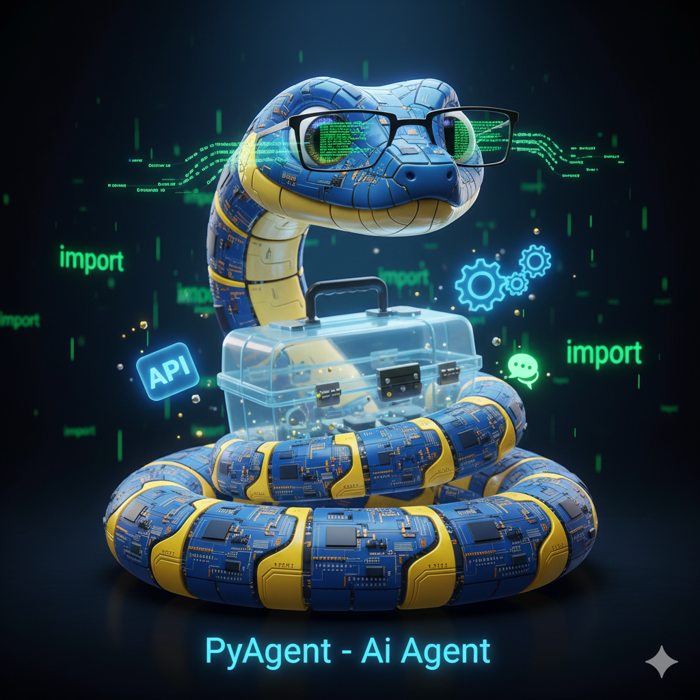
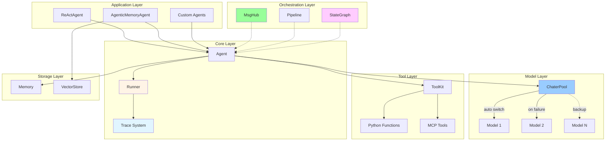

<div align="center">



# PyAgent

_Lightweight Multi-Agent Framework for Python_

[](https://www.python.org/downloads/)
[](LICENSE)


</div>

---

## ✨ Features

- 🎯 **Minimalist** - Clean design, only 13 core modules
- 📊 **Stack-based Trace** - Auto-track multi-agent interactions
- ⚡ **Async-first** - Full async I/O, concurrent tool execution
- 🔄 **Auto-failover** - ChaterPool switches models automatically
- 🧠 **A-MEM** - Self-evolving memory ([arXiv:2502.12110](https://arxiv.org/abs/2502.12110))
- 🤖 **ReAct** - Complete reasoning-action loop
- 🛠️ **MCP** - Native Model Context Protocol support
- 🌐 **Multi-agent** - MsgHub broadcast, Pipeline orchestration
- 🔀 **Workflow** - LangGraph-style StateGraph with conditional routing

## 🚀 Quick Start

```python
import asyncio
from pyagent import Agent, Memory, Chater, Runner, get_chater_cfg

agent = Agent(
    name="Assistant",
    chater=Chater(get_chater_cfg("ali")),
    memory=Memory(),
    system_prompt="You are helpful."
)

async def main():
    result = await Runner.run(agent, "Hello!")
    print(result.content)

asyncio.run(main())
```

### Multi-Agent with Trace

```python
from pyagent import trace, Runner, Agent, Chater, Memory, get_chater_cfg

planner = Agent(name="Planner", chater=Chater(get_chater_cfg("ali")), memory=Memory())
executor = Agent(name="Executor", chater=Chater(get_chater_cfg("ali")), memory=Memory())

async def main():
    with trace("workflow"):
        result = await Runner.run_sequential(
            [planner, executor],
            "Plan and execute"
        )

asyncio.run(main())
```

### StateGraph Workflow

```python
from pyagent import StateGraph, START, END, Channel, AppendReducer

graph = StateGraph()
graph._channels = {"messages": Channel(default=[], reducer=AppendReducer())}

def step1(state):
    return {"value": state.get("input", 0) + 10}

def step2(state):
    return {"output": f"Result: {state['value'] * 2}"}

def router(state):
    return END if state["value"] > 20 else "step2"

graph.add_node("step1", step1)
graph.add_node("step2", step2)
graph.add_edge(START, "step1")
graph.add_conditional_edges("step1", router, {"step2": "step2"})
graph.add_edge("step2", END)

result = graph.compile().invoke({"input": 5})
```

## 📐 Architecture



**Features:**

- ✅ Stack-based - Auto parent-child management
- ✅ Concurrent-safe - contextvars isolation
- ✅ Zero-overhead - Fully disabled without trace
- ✅ Minimal data - Agent span: type/agent_id/input/output only
- ✅ Complete tracking - Generation/Tool/Custom spans

## 🎯 Components

| Component              | Description                                                                       |
| ---------------------- | --------------------------------------------------------------------------------- |
| **Agent**              | Base agent with hooks, streaming, tool calling                                    |
| **Runner**             | Unified interface for single/multi-agent execution                                |
| **ChaterPool**         | Auto-failover when primary model fails                                            |
| **ToolKit**            | Register Python functions or MCP tools                                            |
| **MsgHub**             | Multi-agent broadcast communication                                               |
| **Pipeline**           | Sequential/Parallel/Conditional/Loop patterns                                     |
| **StateGraph**         | LangGraph-style workflow with state, nodes, edges, conditional routing            |
| **WorkflowBuilder**    | Fluent API for building workflows with agents                                     |
| **AgenticMemoryAgent** | A-MEM self-evolving memory ([arXiv:2502.12110](https://arxiv.org/abs/2502.12110)) |

## 🔀 Workflow System

StateGraph provides LangGraph-compatible workflow orchestration:

```python
from pyagent import StateGraph, WorkflowBuilder, START, END, Agent, Chater, Memory, get_chater_cfg

planner = Agent(name="Planner", chater=Chater(get_chater_cfg("ali")), memory=Memory())
executor = Agent(name="Executor", chater=Chater(get_chater_cfg("ali")), memory=Memory())
reviewer = Agent(name="Reviewer", chater=Chater(get_chater_cfg("ali")), memory=Memory())

wf = (
    WorkflowBuilder("plan_execute_review")
    .add_agent("plan", planner)
    .add_agent("execute", executor)
    .add_agent("review", reviewer)
    .add_branch("review", lambda s: END if "APPROVED" in s.get("output", "") else "plan", {})
    .chain("plan", "execute", "review")
    .set_entry("plan")
    .build()
)

result = await wf.ainvoke({"input": "Build a web app"})
```

**Workflow Features:**

| Feature                | Description                                           |
| ---------------------- | ----------------------------------------------------- |
| **StateGraph**         | Define nodes, edges, conditional routing              |
| **Reducers**           | AppendReducer, MergeReducer, AddReducer for state     |
| **Channels**           | Typed state fields with custom merge strategies       |
| **Streaming**          | `astream()` for real-time node execution              |
| **WorkflowBuilder**    | Fluent API: `add_agent()`, `chain()`, `add_branch()`  |
| **Factory Functions**  | `create_react_graph()`, `create_sequential_graph()`   |

## 🙏 Acknowledgments

Inspired by:

- **[OpenAI Agents SDK](https://github.com/openai/openai-agents-python)** - Trace system, Runner pattern
- **[AgentScope](https://github.com/modelscope/agentscope)** - Hook decorators, MsgHub
- **[LangGraph](https://github.com/langchain-ai/langgraph)** - StateGraph, Reducers, Workflow patterns

## 📄 License

MIT License
