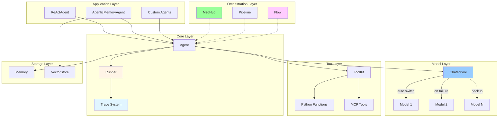

<div align="center">


# PyAgent

_Lightweight Multi-Agent Framework for Python_

[](https://www.python.org/downloads/)
[](LICENSE)


</div>

---

## ✨ Features

- 🎯 **Minimalist** - Clean design, only 12 core modules
- 📊 **Stack-based Trace** - Auto-track multi-agent interactions
- ⚡ **Async-first** - Full async I/O, concurrent tool execution
- 🔄 **Auto-failover** - ChaterPool switches models automatically
- 🧠 **A-MEM** - Self-evolving memory ([arXiv:2502.12110](https://arxiv.org/abs/2502.12110))
- 🤖 **ReAct** - Complete reasoning-action loop
- 🛠️ **MCP** - Native Model Context Protocol support
- 🌐 **Multi-agent** - MsgHub broadcast, Pipeline orchestration
- 🔀 **Flow** - Lightweight workflow with loops, branches, parallel execution

## 🚀 Quick Start

```python
import asyncio
from pyagent import Agent, Memory, Chater, Runner, get_chater_cfg

agent = Agent(
    name="Assistant",
    chater=Chater(get_chater_cfg("ali")),
    memory=Memory(),
    system_prompt="You are helpful."
)

async def main():
    result = await Runner.run(agent, "Hello!")
    print(result.content)

asyncio.run(main())
```

### Multi-Agent with Trace

```python
from pyagent import trace, Runner, Agent, Chater, Memory, get_chater_cfg

planner = Agent(name="Planner", chater=Chater(get_chater_cfg("ali")), memory=Memory())
executor = Agent(name="Executor", chater=Chater(get_chater_cfg("ali")), memory=Memory())

async def main():
    with trace("workflow"):
        result = await Runner.run_sequential(
            [planner, executor],
            "Plan and execute"
        )

asyncio.run(main())
```

### Flow Workflow

```python
from pyagent import Flow, END, Agent, Chater, Memory, get_chater_cfg

writer = Agent(name="Writer", chater=Chater(get_chater_cfg("ali")), memory=Memory())
reviewer = Agent(name="Reviewer", chater=Chater(get_chater_cfg("ali")), memory=Memory())

flow = Flow("write_review").add("write", writer).add("review", reviewer).max_loops(3)
flow.route("write").to("review")
flow.route("review").when(lambda r: "APPROVED" in r.content).to(END).default().to("write")

result = await flow.reply("Write a haiku about coding")
```

## 📐 Architecture



**Features:**

- ✅ Stack-based - Auto parent-child management
- ✅ Concurrent-safe - contextvars isolation
- ✅ Zero-overhead - Fully disabled without trace
- ✅ Minimal data - Agent span: type/agent_id/input/output only
- ✅ Complete tracking - Generation/Tool/Custom spans

## 🔀 Flow System

Lightweight workflow with Agent-native interface:

```python
from pyagent import Flow, END, Agent, Chater, Memory, get_chater_cfg

planner = Agent(name="Planner", chater=Chater(get_chater_cfg("ali")), memory=Memory())
executor = Agent(name="Executor", chater=Chater(get_chater_cfg("ali")), memory=Memory())
reviewer = Agent(name="Reviewer", chater=Chater(get_chater_cfg("ali")), memory=Memory())

flow = Flow("plan_execute_review")
flow.add("plan", planner)
flow.add("execute", executor)
flow.add("review", reviewer)

flow.route("plan").to("execute")
flow.route("execute").to("review")
flow.route("review").when(lambda r: "APPROVED" in r.content).to(END).default().to("plan")

result = await flow.reply("Build a web app")  
```

### Loop Pattern

```python
flow = Flow("review_loop").add("write", writer).add("review", reviewer).max_loops(5)
flow.route("write").to("review")
flow.route("review").when(lambda r: "APPROVED" in r.content).to(END).default().to("write")
```

### Parallel Execution

```python
flow = Flow("parallel").parallel("experts", [tech, biz, legal]).add("summarize", summarizer)
flow.route("experts").to("summarize")
```

### Chain Helper

```python
from pyagent import chain
flow = chain(agent_a, agent_b, agent_c)
result = await flow.reply("Start")
```

## 🙏 Acknowledgments

Inspired by:

- **[OpenAI Agents SDK](https://github.com/openai/openai-agents-python)** - Trace system, Runner pattern
- **[AgentScope](https://github.com/modelscope/agentscope)** - Hook decorators, MsgHub

## 📄 License

MIT License
